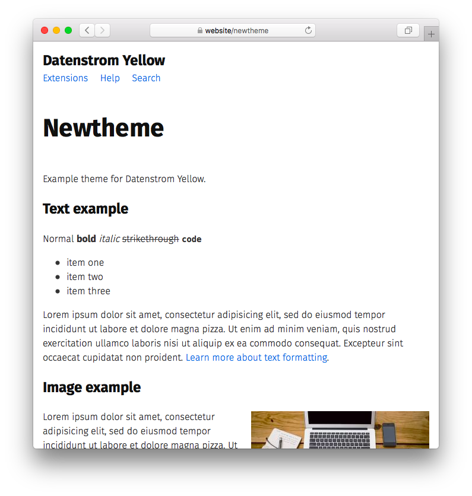

# Newtheme 0.9.1

Example theme for Datenstrom Yellow.

## How to install an extension

[Download ZIP file](https://github.com/datenstrom/yellow-newtheme/archive/refs/heads/main.zip) and copy it into your `system/extensions` folder. [Learn more about extensions](https://github.com/annaesvensson/yellow-update).

## How to make a new theme

Create a new repository on GitHub or Codeberg, for example click on `Use this template` in the top-right corner. Edit the README file in your repository and replace the download link with the download link of your repository. [Learn more about making extensions](https://github.com/annaesvensson/yellow-publish).

## How to customise a theme

You can customise the appearance of your website with HTML and CSS. All HTML files are stored in your `system/layouts` folder. All CSS files are stored in your `system/themes` folder. You can change these files as you like and also add your own files. Your changes will not be overwritten when the website is updated. [Learn more about themes](https://datenstrom.se/yellow/help/how-to-customise-a-theme).

The default theme is defined in file `system/extensions/yellow-system.ini`. A different theme can be defined in the [page settings](https://github.com/annaesvensson/yellow-core#settings-page) at the top of each page, for example `Theme: newtheme`.

## Acknowledgements

This extension includes Fira Sans by Ralph du Carrois. Thank you for the beautiful font.

## Designer

Your name. [Get help](https://datenstrom.se/yellow/help/).
